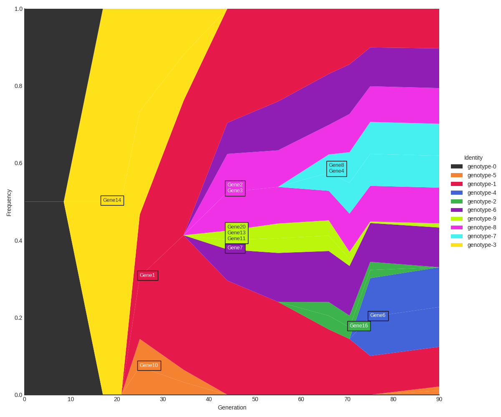
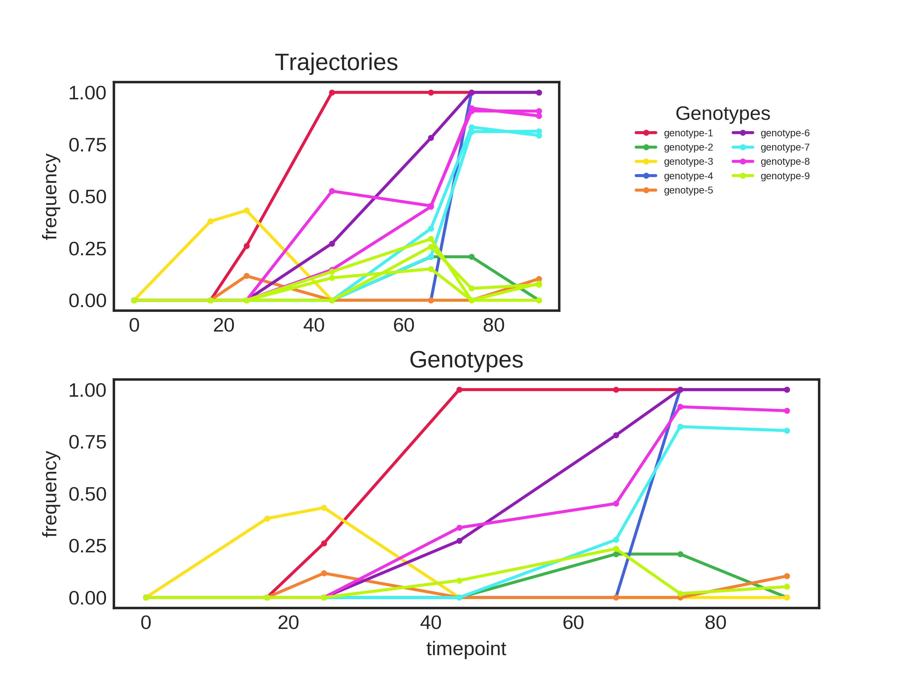
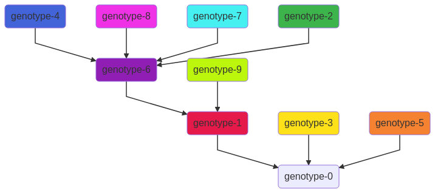

# A set of scripts to cluster mutational trajectories into genotypes and cluster genotypes by background


## Contents
-  [General Workflow](#general-workflow)
-  [Script Options](#script-options)
-  [Input Parameters](#input-parameters)
-  [Sample Usage](#sample-usage)
-  [Output Files](#output-files)
-  [Genotype Plots](#genotype-plots)
-  [Mermaid Diagram](#mermaid-diagram)

## General Workflow

Flowcharts for each individual step can be found under docs/flowcharts.


## Script Options

	-h, --help                  Show this help message and exit
	-i, --input                 The table of trajectories to cluster. Must be an excel file or csv/tsv file.
	-o,  --output               The folder to save the files to.
	--method                    The clustering method to use when grouping mutatoinal trajectories into genotypes.
                                Available methods: 'matlab', 'hierarchy'
	-u, --uncertainty           The uncertainty to apply when performing
	                            frequency-based calculations. For
	                            example, a frequency at a given timepoint
	                            is considered undetected if it falls
	                            below 0 + `uncertainty`.
	--fixed                     The minimum frequency at which to
	                            consider a mutation fixed. Defaults to
	                            1 - `uncertainty`
	-s, --significant           [0.15] The frequency at which to consider a genotype
	                            significantly greater than zero.
	-f, --frequencies           [0.10] The frequency cutoff to use when sorting genotypes.
	                            May be a comma-separated string of frequencies, or a set inverval
	                            to use when generating the frequency breakpoints.
	                            For example, a value of 0.15 will use the frequencies 0,.15,.30,.45...
	-r --similarity-cutoff      [0.05] Maximum p-value difference to consider trajectories related.
	                            Used when grouping trajectories into genotypes.
	-l, --difference-cutoff     [0.10] Used to unlink unrelated trajectories present in a genotype. Is not used
	                            when using hierarchical clustering.
	--genotypes                 Indicates that the input table contains genotypes rather
	                            than mutational trajectories.
	--matlab                    Mimics the output of the original matlab script.
	--no-filter                 Skips the genotype filtering step.
	--annotate-all              By default, the muller diagrams only annotate the top 3 (by frequency)
	                            genes for each genotype. This option forces the scripts to annotate
	                            all genes associated with each genotype.
    --save-pvalues              Saves the p-values to a table and generates a heatmap
                                for the population. Disabling saves a large amount of
                                time for large datasets.

## Input Parameters

The script operates on a table listing all mutations and their corresponding frequencies at each timepoint (refered to as "trajectories" in this script) or a table with each genotype and frequency at each timepoint (ex. the genotype table in the examples folder).
The table must have a column named `Trajectory` with labels for each mutational trajectory (or `Genotype` when using `--genotype`) and integer columns for each timepoint. The labels are solely used to identify trajectories belonging to a specific genotype, and must be integers. All other columns will be ignored when calculating genotypes and genotype clusters.
The frequencies can be represented as either a number between 0 - 1,
a number between 0 - 100 or as percentage.
The `Trajectory` and `Genotype` columns can contain any kind of label, but must be unique for each trajectory/genotype. 

| Population | Trajectory    | Chromosome | Position | Class | Mutation | 0 | 17    | 25    | 44    | 66    | 75    | 90    |
|------------|---------------|------------|----------|-------|----------|---|-------|-------|-------|-------|-------|-------|
| B2         | 1             | 1          | 38102    | SNP   | C>T      | 0 | 0     | 26.1% | 100%  | 100%  | 100%  | 100%  |
| B2         | 2             | 1          | 62997    | SNP   | T>G      | 0 | 0     | 0     | 52.5% | 45.4% | 91.1% | 91%   |
| B2         | 3             | 1          | 78671    | SNP   | A>C      | 0 | 0     | 0     | 14.7% | 45%   | 92.4% | 88.7% |
| B2         | 4             | 1          | 96585    | SNP   | T>G      | 0 | 0     | 0     | 0     | 21.1% | 81.1% | 81.3% |
| B2         | 5             | 1          | 115010   | SNP   | G>T      | 0 | 0     | 0     | 40.3% | 48.9% | 5.7%  | 8%    |
| B2         | 6             | 1          | 156783   | SNP   | C>G      | 0 | 0     | 0     | 0     | 0     | 100%  | 100%  |
| B2         | 7             | 1          | 176231   | SNP   | T>A      | 0 | 0     | 0     | 27.3% | 78.1% | 100%  | 100%  |
| B2         | 8             | 1          | 205211   | SNP   | C>T      | 0 | 0     | 0     | 0     | 34.5% | 83.3% | 79.3% |
| B2         | 9             | 1          | 223199   | SNP   | C>G      | 0 | 0     | 0     | 0     | 0     | 26.9% | 34%   |
| B2         | trajectory-10 | 1          | 262747   | SNP   | T>C      | 0 | 0     | 11.7% | 0     | 0     | 0     | 10.3% |
| B2         | trajectory-11 | 1          | 264821   | SNP   | C>T      | 0 | 0     | 0     | 10.8% | 15.1% | 0     | 0     |
| B2         | trajectory-12 | 1          | 298548   | SNP   | G>A      | 0 | 12.5% | 0     | 15.3% | 18.1% | 17.5% | 19.1% |
| B2         | trajectory-13 | 1          | 299331   | SNP   | G>A      | 0 | 0     | 0     | 0     | 25.8% | 5.7%  | 7.5%  |
| B2         | trajectory-14 | 1          | 299332   | SNP   | C>T      | 0 | 38%   | 43.2% | 0     | 0     | 0     | 0     |
| B2         | t15           | 1          | 299332   | SNP   | C>T      | 0 | 0     | 6.6%  | 10.4% | 6.2%  | 0     | 0     |
| B2         | t16           | 1          | 299332   | SNP   | C>T      | 0 | 0     | 0     | 0     | 20.9% | 20.9% | 0     |
| B2         | t17           | 1          | 299332   | SNP   | C>T      | 0 | 0     | 0     | 0     | 0     | 26.6% | 31.2% |
| B2         | t18           | 1          | 299332   | SNP   | C>T      | 0 | 0     | 0     | 11.5% | 0     | 13.1% | 0     |
| B2         | t19           | 1          | 299332   | SNP   | C>T      | 0 | 0     | 0     | 18.8% | 17.1% | 23.2% | 24.4% |
| B2         | 20            | 1          | 299332   | SNP   | C>T      | 0 | 0     | 0     | 13.8% | 29.5% | 0     | 8.1%  |
| B2         | 21            | 1          | 299332   | SNP   | C>T      | 0 | 0     | 0     | 11.4% | 0     | 11%   | 12.3% |

## Sample Usage

```
python muller_workflow.py --input [input filename] --output [output folder]
```

Run with default parameters.

```
python muller_workflow.py --input [filename] --output [folder] --matlab
```
Trajectories will be grouped into genotypes and each genotype will be nested using the same parameters the original matlab script used. The original script used different values in each script when performing frequency detection/significance. The improved version of the script (without the --matlab flag) harmonized these parameters so that similar calculations use the same parameter rather than re-defining the value to use.
```
python muller_workflow.py --input [filename] --frequencies 0.05 --detected 0.10
```
Groups genotypes in groups of 0.05 (i.e. `[0.00, 0.05, 0.10, ... , 0.90, 0.95, 1.00]`) based on each genotype's maximum frequency. Each genotype in each group is then sorted by the timepoint it was first detected (the first timepoint where the frequency was greater than 0.10). Output files are saved to the same folder as the input table.

## Output Files

The script generates the following files:

### Tables

- `input filename`.genotypes.tsv

	A tab-delimited table with the mean frequency of each genotype at each timepoint. The mean is calculated from the trajectories that comprise each genotype.

- `input filename`.trajectories.tsv

	A tab-delimited table of the population trajectories used in the analysis. Each trajectory represents the frequency of a single mutation at each timepoint.

-  `input filename`.ggmuller.edges.tsv

	Used as the `edges` input to ggmuller.

- `input filename`.ggmuller.populations.tsv

	Used as the `population` input to ggmuller.

-  supplementary-files / `input filename`.genotypes.original.tsv

    The initial genotypes generated before applying the genotype filters.

- supplementary-files / `input filename`.trajectories.original.tsv

    The unfiltered trajectories.

- supplementary-files / `input filename`.muller.csv

    The table generated by ggmuller and used to generate the muller diagrams.

- supplementary-files / `input filename`.pvalues.tsv

    A tab-delimited file listing the calculated p-value for each pair of mutational trajectories. Only created
    if `--save-pvalues` is provided.
    
- supplementary-files / `input filename`.calculation.matrix.pvalues.tsv
    
    A table with all pairwise p-values for all trajectories. 
    Rows/columns are sorted by genotype and share the same order.
    Requires `--save-pvalues`

- supplementary-files / `input filename`.calculation.matrix.distance.tsv
    A table with all pairwise distances for all trajectories. 
    Rows/columns are sorted by genotype and share the same order.
    Requires `--save-pvalues`
    
### Diagrams

- `input filename`.muller.basic.png

	The muller plot generated by the r script. Colors correspond to the same genotypes in the genotype plots.

- `input filename`.muller.annotated.png, `input filename`.muller.annotated.pdf
    
    A muller plot annotated with relevant mutations listed in the `Gene` column of the trajectory table. 
    Only the top 3 mutations (by frequency) are included if `--annotate-all` is not given.

-  `input_filename`.png

    Plots of all trajectories (colored by parent genotype) and genotypes.

- `input filename`.filtered.png
    Plot of all trajectories and genotypes with filtered mutations included. Identical to the above if `--no-filter` is provided.

- `input filename`.mermaid.png

    If [mermaid.cli](https://github.com/mermaidjs/mermaid.cli) is installed, the mermaid script will automatically be used to generate a map of nested genotypes.

- supplementary-files / `input filename`.heatmap.pvalues.png
    A heatmap of the p-value matrix table. Only created in `--save-pvalues` is given. Requires the [seaborn](https://seaborn.pydata.org) library.

- supplementary-files / `input filename`.heatmap.distance.png
        A heatmap of the distance matrix table. Only created in `--save-pvalues` is given. Requires the [seaborn](https://seaborn.pydata.org) library.

### Other

- supplementary-files / `input filename`.r

	A basic r script to import the `population` and `edges` tables and generate a muller plot.

-  supplementary-files / `input filename`.mermaid.md

	A script written in the [mermaid](https://mermaidjs.github.io) scripting language. Generates a diagram indicating the hierarchy of genotypes/backgrounds in the current population.

-  `input filename`.json

	Contains the parameters used for the analysis. See the flowcharts in /docs/flowcharts to see where each parameter is used.

## Genotype Plots
The `.genotypeplot.png` file gives an easy-to-visualize plot of all trajectory and genotype frequencies over time.
Trajectories are colored based on their parent genotype.


## Mermaid Diagram

The `.mermaid` file can be used to generate a quick diagram showing the relation between all genotypes in the population.


