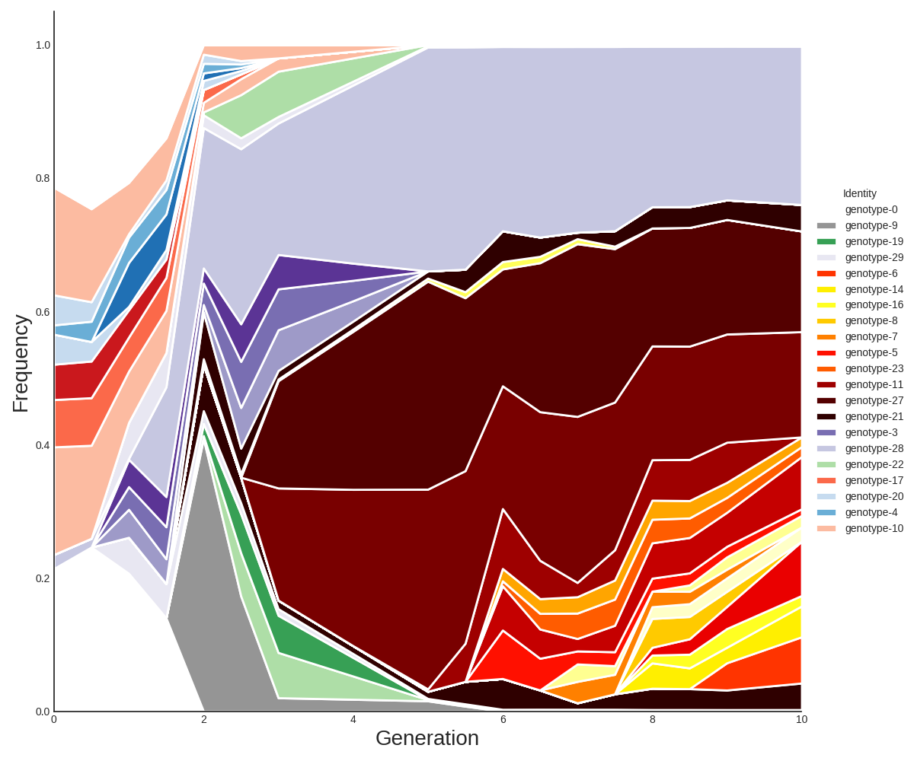
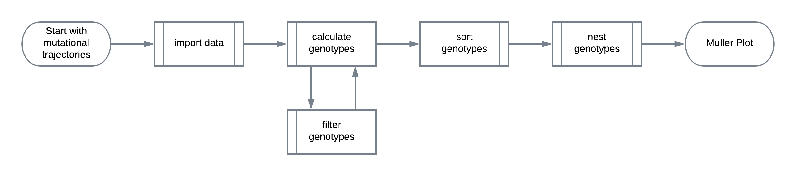
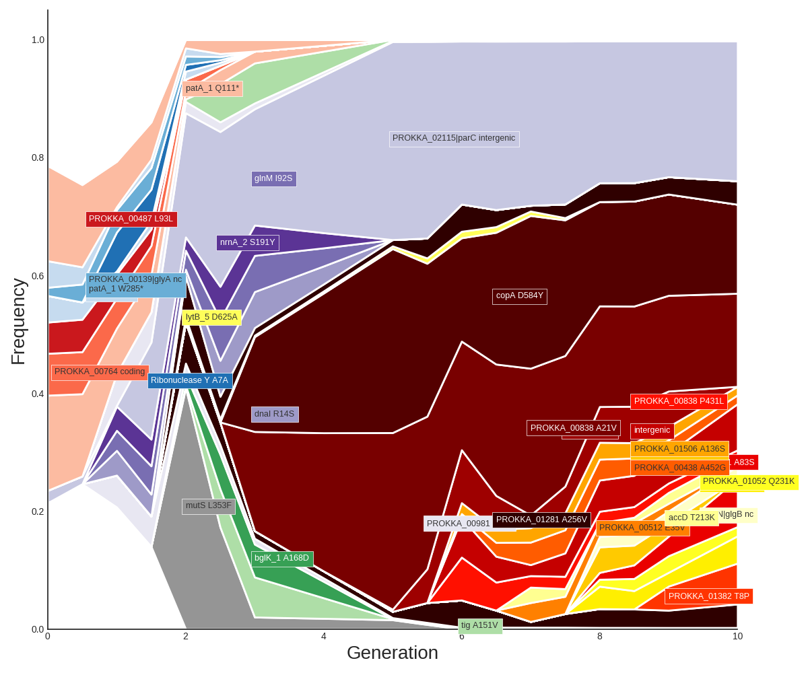
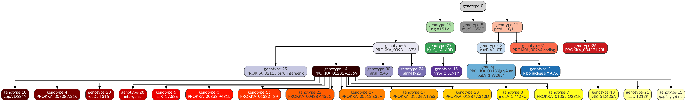
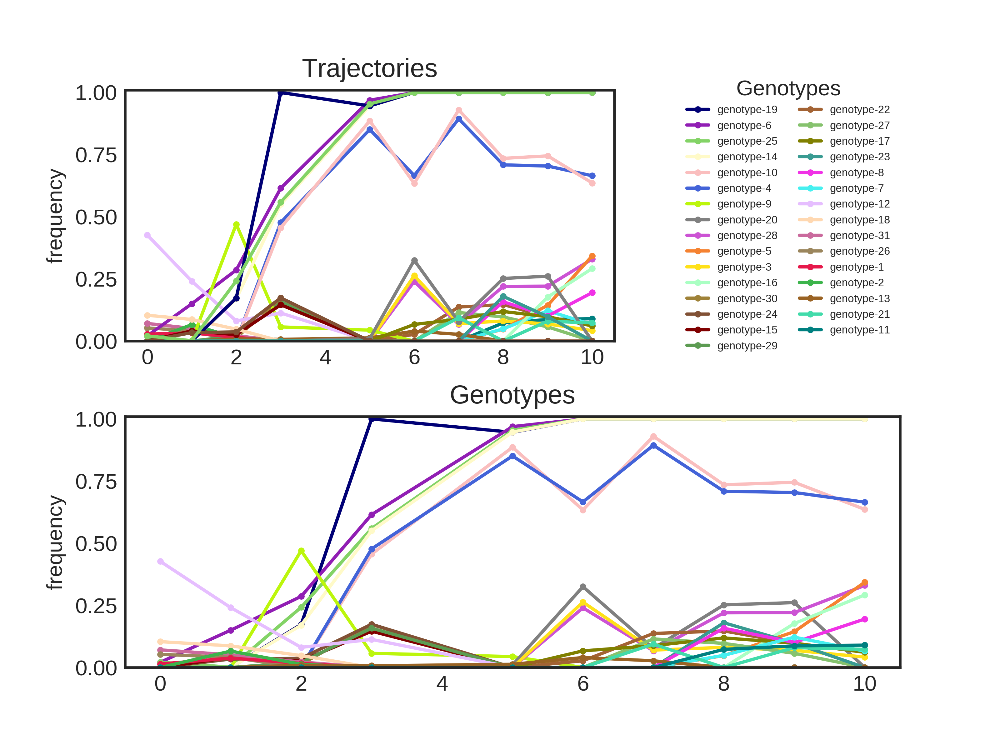
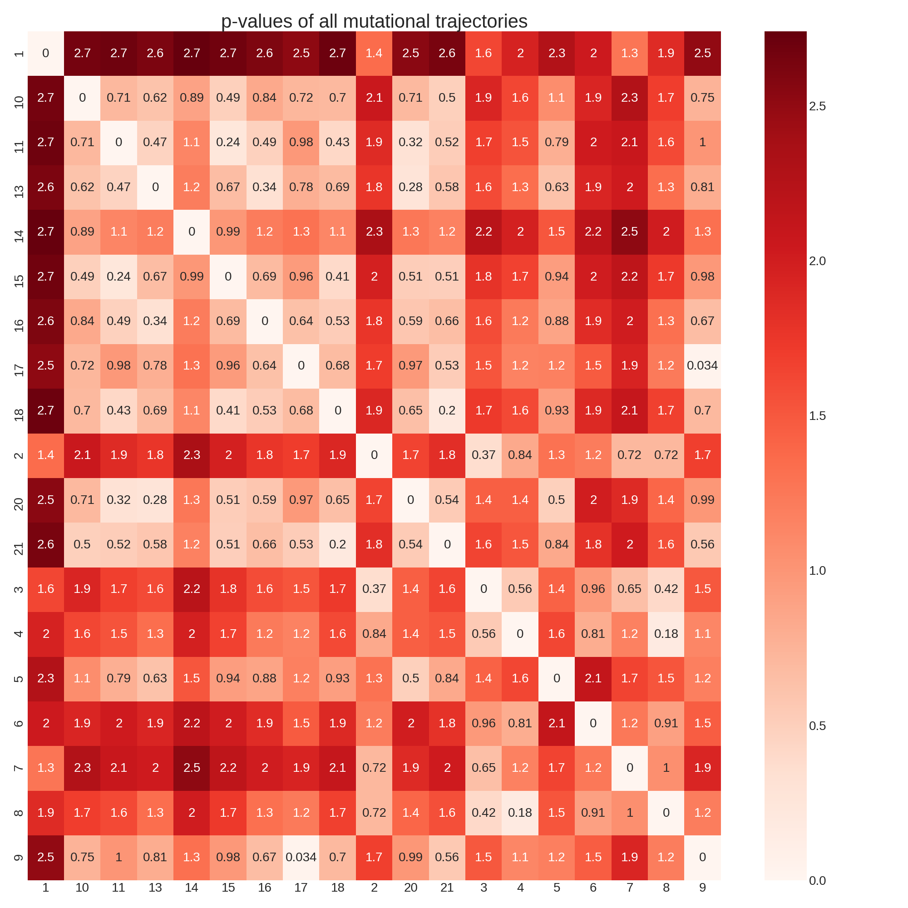

# A set of scripts to cluster mutational trajectories into genotypes and cluster genotypes by background


# Contents
-  [Installation](#installation)
-  [Sample Usage](#sample-usage)
-  [Requirements](#requirements)
-  [General Workflow](#general-workflow)
-  [Script Options](#script-options)
-  [Input Parameters](#input-dataset)
-  [Output Files](#output)
    -  [Output Tables](#tables)
    -  [Muller Plots](#muller-plots)
    -  [Genotype Plots](#timeseries-plots)
    -  [Lineage Diagram](#lineage-diagrams)

# Installation
These scripts are available on (pypi)[https://pypi.org/project/muller/] and can be installed with
```bash
pip install muller 
```
To update the scripts to the newest version, simply run 
```bash
pip install muller --upgrade
```

It is also possible to simply clone the package, although the additional required packages would then need to be installed separately.
```
git clone https://github.com/cdeitrick/muller_diagrams.git
cd muller_diagrams
Muller.py [args]
```

# Requirements
The scripts require a few python packages to work. Each of these can be installed using `pip install [package]` or `conda install [package]`.
- dataclasses (if using a python version below 3.7)
- loguru
- matplotlib
- pandas
- pygraphviz
- scipy
- seaborn
- xlrd (to read excel files)

If the package `pygraphviz` throws an error during installation, it is usually because it can't find the correct dependancies in the current environment.
Install the dependancies using 

Linux:
```bash
sudo apt-get install python-dev graphviz libgraphviz-dev pkg-config
```
Mac:
```bash
brew install graphviz
```
or the equivalent package manager on your system.

Additionally, `r` should be installed on your system in order to run the generated rscript file with the packages `ggplot2` and `ggmuller`.

## Optional Packages
If `tqdm` is also installed, the scripts will display a progressbar for large datasets.
Sometimes the encoding of csv files is ambiguous (the scripts throw a UnicodeDecodeError). If `beautifulsoup4` is installed the scripts will attempt to correct encoding errors.


# Sample Usage
The scripts currently default to hierarchical clustering using the binomial distance. More information is available in the "description" folder.
Use python to call the "muller" folder:
```
Muller.py --input [input filename] --output [output folder]
```

Run with default parameters.

```
Muller.py --input [filename] --frequencies 0.05 --detected 0.10
```
Groups genotypes in groups of 0.05 (i.e. `[0.00, 0.05, 0.10, ... , 0.90, 0.95, 1.00]`) based on each genotype's maximum frequency. Each genotype in each group is then sorted by the timepoint it was first detected (the first timepoint where the frequency was greater than 0.10). Output files are saved to the same folder as the input table.

# General Workflow

Flowcharts for each individual step can be found under docs/flowcharts.



# Script Options

## General Options
	-h, --help                  
                                Show a help message and exit
    --name                      
                                Prefix to use when naming the output files. defaults to the dataset filename.
	-i, --input                
                                The table of trajectories to cluster. Must be an excel file or csv/tsv file.
                                The delimiter will be inferred from the file extension.
	-o,  --output               
                                The output folder to save the files to.
	-d, --detection             
                                The uncertainty to apply when performing
	                            frequency-based calculations. For
	                            example, a frequency at a given timepoint
	                            is considered undetected if it falls
	                            below 0 + `detection`.
	--fixed                     
                                The minimum frequency at which to
	                            consider a mutation fixed. Defaults to
	                            1 - `uncertainty`
	-s, --significant           
                                [0.15] The frequency at which to consider a genotype
	                            significantly greater than zero.
	-f, --frequencies           
                                [0.10] The frequency cutoff or step to use when sorting genotypes.
	                            May be a comma-separated string of frequencies, or a set inverval
	                            to use when generating the frequency breakpoints. This affects
                                the filtering step and the nesting step.
	                            For example, a value of 0.15 will use the frequencies 0,.15,.30,.45...
	--genotypes                 Indicates that the input table contains genotypes rather
	                            than mutational trajectories.
	--no-filter                 
                                Disables the genotype filtering step.
    --include-single            
                                Disables the filter which rejects trajectories detected at a single timepoint.
    --sheetname                 
                                Specifies the sheet to use when the input is an excel file. Defaults to
                                'Sheet1'
    --strict-filter             
                                By default, the filters allow trajectories to appear both before and after a genotype
                                fixes as long as they were undetected at the timepoint the sweep occurs. This generally
                                represents mutations which appear, are removed during a genotype sweep, and reappear
                                afterwards. Using `--strict-filter` would remove these trajectories.
    --genotype-colors           Path to a file with a custom genotype colorscheme. The file should be tab-delimited
                                with a genotype name (ex. 'genotype-13') in the first column and a HEX color code
                                (ex. '#F5674A') in the second. These colors will override the default colorscheme.
    --gene-alias ALIAS_FILENAME
                                An optional two-column file with more accurate gene
                                names. This is useful when using a reference
                                annotated via prokka.

## Clustering Options
    -m, --method                Selects the clustering method to use. 'two-step' will use the original two-step
                                method of sorting trajectories into genotypes while 'hierarchy' will use
                                hierarchical clustering to do the clustering. Defaults to 'matlab'
    --metric                    Used to select the distance metric when `--method` is set to 'hierarchy'.
        Available Options:
        'similarity', 'binomial' [Default] Uses the binomial test implemented in the original matlab scripts as a distance metric.
        'jaccard'               Uses the Jaccard distance between two series to determine the distance metric.
        'minkowski'             Uses the minkowski distance as a distance metric. Primarily influenced by the
                                difference between two series.
        'pearson'               Uses the pearson correlation coefficient as the distance metric. Primarily
                                influenced by the correlation of two series against each other.
        'combined'              A combination of the 'pearson' and 'minkowski' distances to account for the
                                correlation of two series as well as the difference between them.
    -r --similarity-cutoff      
                                [0.05] Used when grouping trajectories into genotypes.
                                Maximum p-value difference to consider trajectories related when using
                                the two-step method, and selects the maximum distance to consider
                                trajectories related when `--method` is `hierarchy`.

    -d, --difference-cutoff     [0.10] Only used when `--method` is `twostep`.
                                Used to unlink unrelated trajectories present in a genotype. Is not used
                                when using hierarchical clustering.
    -g, --known-genotypes       
                                Path to a file listing trajectories which are known to be in the same genotype.
                                Each line in the file represents a single genotype, and each line should be a
                                comma-separated list of trajectory labels as they appear in the input dataset.

## Nesting Options
    --additive
                                [0.03] Controls how the additive score between a nested and
                                unnested genotype is calculated. Defaults to the
                                detection cutoff value.
    --subtractive
                                Controls when the combined frequencies of a nested and
                                unnested genotype are considered consistently larger
                                than the fixed cutoff.Defaults to the detection cutoff
                                value. (default: None)
    --derivative
                                Controls how much a nested and unnested genotype
                                should be correlated/anticorrelated to be considered
                                significant (default: 0.01). Correlation implies a positive relationship
                                between the nested/unnested genotypes while anticorrelation is evidence
                                against nesting the unnested genotype under the nested genotype.
    --known-ancestry
                                A tab-delimited file designating the known ancestry of certain
                                genotypes. The left column should be the genotype to nest,
                                right column should be its parent. Column names are ignored.
                                Genotype names are generated during the clustering step,
                                so this is only useful when re-running the analysis.

## Graphics Options
    --no-outline
                                Disables the white ouline surrounding each series in the muller plots.

# Input Dataset

The script operates on a table listing all mutations and their corresponding frequencies at each timepoint (refered to as "trajectories" in this script) or a table with each genotype and frequency at each timepoint (ex. the genotype table in the examples folder).
The table must have a column named `Trajectory` with labels for each mutational trajectory (or `Genotype` when using `--genotype`) and integer columns for each timepoint. The labels are solely used to identify trajectories belonging to a specific genotype, and must be integers. All other columns will be ignored when calculating genotypes and genotype clusters.
The frequencies can be represented as either a number between 0 - 1,
a number between 0 - 100 or as percentage.
The `Trajectory` and `Genotype` columns can contain any kind of label, but must be unique for each trajectory/genotype.

| Population | Trajectory    | Chromosome | Position | Class | Mutation | 0 | 17    | 25    | 44    | 66    | 75    | 90    |
|------------|---------------|------------|----------|-------|----------|---|-------|-------|-------|-------|-------|-------|
| B2         | 1             | 1          | 38102    | SNP   | C>T      | 0 | 0     | 26.1% | 100%  | 100%  | 100%  | 100%  |
| B2         | 2             | 1          | 62997    | SNP   | T>G      | 0 | 0     | 0     | 52.5% | 45.4% | 91.1% | 91%   |
| B2         | 3             | 1          | 78671    | SNP   | A>C      | 0 | 0     | 0     | 14.7% | 45%   | 92.4% | 88.7% |
| B2         | 4             | 1          | 96585    | SNP   | T>G      | 0 | 0     | 0     | 0     | 21.1% | 81.1% | 81.3% |
| B2         | 5             | 1          | 115010   | SNP   | G>T      | 0 | 0     | 0     | 40.3% | 48.9% | 5.7%  | 8%    |
| B2         | t16           | 1          | 299332   | SNP   | C>T      | 0 | 0     | 0     | 0     | 20.9% | 20.9% | 0     |
| B2         | 6             | 1          | 156783   | SNP   | C>G      | 0 | 0     | 0     | 0     | 0     | 100%  | 100%  |
| B2         | 7             | 1          | 176231   | SNP   | T>A      | 0 | 0     | 0     | 27.3% | 78.1% | 100%  | 100%  |
| B2         | 8             | 1          | 205211   | SNP   | C>T      | 0 | 0     | 0     | 0     | 34.5% | 83.3% | 79.3% |
| B2         | 9             | 1          | 223199   | SNP   | C>G      | 0 | 0     | 0     | 0     | 0     | 26.9% | 34%   |
| B2         | trajectory-10 | 1          | 262747   | SNP   | T>C      | 0 | 0     | 11.7% | 0     | 0     | 0     | 10.3% |
| B2         | trajectory-11 | 1          | 264821   | SNP   | C>T      | 0 | 0     | 0     | 10.8% | 15.1% | 0     | 0     |
| B2         | trajectory-12 | 1          | 298548   | SNP   | G>A      | 0 | 12.5% | 0     | 15.3% | 18.1% | 17.5% | 19.1% |
| B2         | trajectory-13 | 1          | 299331   | SNP   | G>A      | 0 | 0     | 0     | 0     | 25.8% | 5.7%  | 7.5%  |
| B2         | trajectory-14 | 1          | 299332   | SNP   | C>T      | 0 | 38%   | 43.2% | 0     | 0     | 0     | 0     |
| B2         | t15           | 1          | 299332   | SNP   | C>T      | 0 | 0     | 6.6%  | 10.4% | 6.2%  | 0     | 0     |
| B2         | t16           | 1          | 299332   | SNP   | C>T      | 0 | 0     | 0     | 0     | 20.9% | 20.9% | 0     |
| B2         | t17           | 1          | 299332   | SNP   | C>T      | 0 | 0     | 0     | 0     | 0     | 26.6% | 31.2% |
| B2         | t18           | 1          | 299332   | SNP   | C>T      | 0 | 0     | 0     | 11.5% | 0     | 13.1% | 0     |
| B2         | t19           | 1          | 299332   | SNP   | C>T      | 0 | 0     | 0     | 18.8% | 17.1% | 23.2% | 24.4% |
| B2         | 20            | 1          | 299332   | SNP   | C>T      | 0 | 0     | 0     | 13.8% | 29.5% | 0     | 8.1%  |
| B2         | 21            | 1          | 299332   | SNP   | C>T      | 0 | 0     | 0     | 11.4% | 0     | 11%   | 12.3% |


# Output
All files are prefixed by the name of the original input table if the `--name` parameter is unfilled.

## Tables

### Timeseries tables
- .muller_genotypes.tsv
- .muller.trajectories.tsv
- tables/.muller_genotypes.original.tsv
- tables/.trajectories.original.tsv

Tables listing the genotypes and trajectories encountered in the analysis. The trajectory tables also link each trajectory to its respective genotype. There are two versions of these tables: one set with the original input trajectories and the initial calculated genotypes and another set with the final trajectories and genotypes left in the analysis after the filtering step. The trajectory tables include all columns from the input trajectory table as well as the timeseries and annotation columns used in the analysis.

Example Genotype Table:

| Genotype    | 0.000 | 17.000 | 25.000 | 44.000 | 66.000 | 75.000 | 90.000 |
| ----------- | ----- | ------ | ------ | ------ | ------ | ------ | ------ |
| genotype-1  | 0.000 | 0.380  | 0.432  | 0.000  | 0.000  | 0.000  | 0.000  |
| genotype-2  | 0.000 | 0.000  | 0.000  | 0.403  | 0.489  | 0.057  | 0.080  |
| genotype-3  | 0.000 | 0.000  | 0.000  | 0.000  | 0.000  | 1.000  | 1.000  |
| genotype-4  | 0.000 | 0.000  | 0.261  | 1.000  | 1.000  | 1.000  | 1.000  |
| genotype-5  | 0.000 | 0.000  | 0.000  | 0.273  | 0.781  | 1.000  | 1.000  |
| genotype-6  | 0.000 | 0.000  | 0.092  | 0.052  | 0.031  | 0.000  | 0.052  |
| genotype-7  | 0.000 | 0.000  | 0.000  | 0.000  | 0.278  | 0.822  | 0.803  |
| genotype-8  | 0.000 | 0.000  | 0.000  | 0.336  | 0.452  | 0.918  | 0.899  |
| genotype-9  | 0.000 | 0.000  | 0.000  | 0.076  | 0.043  | 0.219  | 0.255  |
| genotype-10 | 0.000 | 0.021  | 0.000  | 0.086  | 0.182  | 0.095  | 0.058  |


### Tables for ggmuller
- tables/.ggmuller.populations.tsv
- tables/.ggmuller.edges.tsv

These tables are designed for use with the ggmuller r package. The `populations` table describes the population/abundance of each genotype at each timepoint while the `edges` table describes the ancestry relationship between genotypes.

### Linkage matrix
- tables/.linkagematrix.tsv

This table is generated using the [scipy](https://docs.scipy.org/doc/scipy/reference/cluster.hierarchy.html) python package. It describes the agglomeration of clusters starting with the individual trajectories, as well as the mean, variance, and trajectory count of each cluster.
Columns:
- `left`, `right`: The two sub-clusters merged to create the current clusters
- `clusterId`: The id assigned to this cluster. Note that since the individual genotypes are not included in the table, the clusters are numbered in order starting with 1 + the total number of genotypes.
- `distance`: The distance between the two sub-clusters.
- `observations`: The number of mutational trajectories contained in this cluster.

Example linkage matrix:

| left | right | distance | observations | resultingCluster |
|------|-------|----------|--------------|------------------|
| 7    | 18    | 0.034    | 2            | 19               |
| 13   | 17    | 0.175    | 2            | 20               |
| 8    | 11    | 0.199    | 2            | 21               |
| 2    | 5     | 0.239    | 2            | 22               |
| 10   | 3     | 0.279    | 2            | 23               |
| 9    | 12    | 0.370    | 2            | 24               |
| 23   | 6     | 0.529    | 3            | 25               |
| 22   | 21    | 0.624    | 4            | 26               |
| 26   | 1     | 0.708    | 5            | 27               |
| 24   | 16    | 0.760    | 3            | 28               |
| 14   | 25    | 0.786    | 4            | 29               |
| 15   | 20    | 0.988    | 3            | 30               |
| 29   | 27    | 1.094    | 9            | 31               |
| 31   | 19    | 1.358    | 11           | 32               |
| 30   | 28    | 1.362    | 6            | 33               |
| 4    | 32    | 1.499    | 12           | 34               |
| 33   | 0     | 2.125    | 7            | 35               |
| 34   | 35    | 4.943    | 19           | 36               |

### Distance Matrix
- tables/.distance.tsv

A table of pairwise distance values between each trajectory.

### Muller table
- tables/.muller.tsv

The converted form of the `.ggmuller.populations.tsv` and `.ggmuller.edges.tsv` used to generate the muller plots. This file is created from the r script, described later.

## Graphics
Each of the output plots use the same palette for genotypes and trajectories. A genotype colored a shade of blue will share that color across all graphs and diagrams which depict that genotype. There are two palettes: one to indicate each clade in the geneology and one to easily distinguish between different genotypes. Each graphic is created with both palettes, and some are provided in multiple formats for convienience.

### Muller Plots
- .muller.annotated.png
- graphics/clade/.muller.annotated.svg
- graphics/clade/.muller.annotated.png
- graphics/clade/.muller.unannotated.png
- graphics/distinctive/.muller.annotated.distinctive.png
- graphics/distinctive/.muller.annotated.distinctive.svg

The main value of a muller plot is to quickly visualize abundance and geneology of genotypes over the course of an evolution experiment.



### Lineage Diagrams
- .lineage.png
- graphics/.lineage.distinctive.png

These are simple flowcharts indicating the relationship between genotypes and clades. The original genotype of each clade are shown to arise in "genotype-0", the root background. The ancestry of all other genotypes are then shown relative to these clades.



### Timeseries plots
- .genotypes.png
- .genotypes.filtered.png
- .trajectories.distinctive.png

Timeseries plots of the frequency of each trajectory and genotype at each timepoint. Trajectories are colored according to which genotype they were grouped into. The `.genotypes.filtered.png` file includes trajectories that were filtered out during the filtering step (clored black).



### Distance Heatmap
- graphics/.heatmap.distance.png

A pairwise comparison of the calculated distance between each mutational trajectory. Trajectories are grouped by the final genotype. The heatmap will be annotated with the distance values if there are fewer than thirty total trajectories in the analysis.



### Dendrogram
- graphics/.dendrogram.png
Shows the arrangement and distance between clusters and member trajectories. Not available with `--method twostep`.


## Scripts
- scripts/example.r

One external script is used during the course of this analysis. The r script is based on the [ggmuller](https://cran.r-project.org/web/packages/ggmuller/vignettes/ggmuller.html) package implemented in r, and is used to convert the genotypes data into a format required to generate the muller plots. This script also generates a basic muller plot (/graphics/distinctive/.muller.png), although all other muller plots are created with the python implementation.

## Supplementary files
- supplementary-files/.json

A json-formatted file with all parameters used in the analysis.

- supplementary-files/.nestscores.tsv

Lists the scores between each genotype and the corresponding candidate ancestry genotypes. The highest score above or equal to 1 determines the parent genotype.
