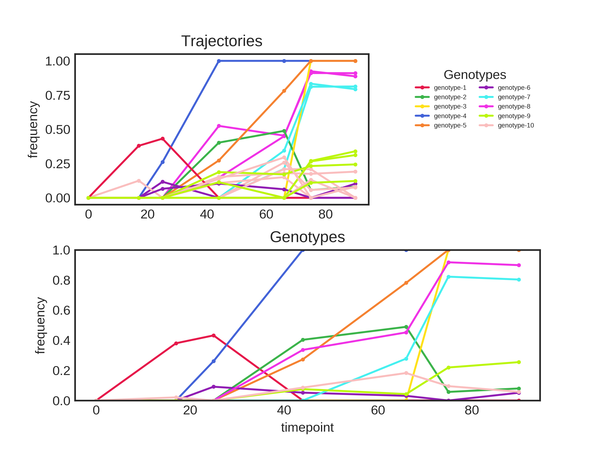

 The scripts currently use the two-step method by default, but this will be replaced by the hierarchical method after more testing is done.
 The hierarchical method and the desired distance metric can be selected using the `--method` and `--metric` options, respectively.

 # Binomial Distance

 The binomial distance is currently the best method for clustering trajectories into genotypes based on the testing that has been done so far.

 For the B1 testing population, the two-step method produces the following clusters:

