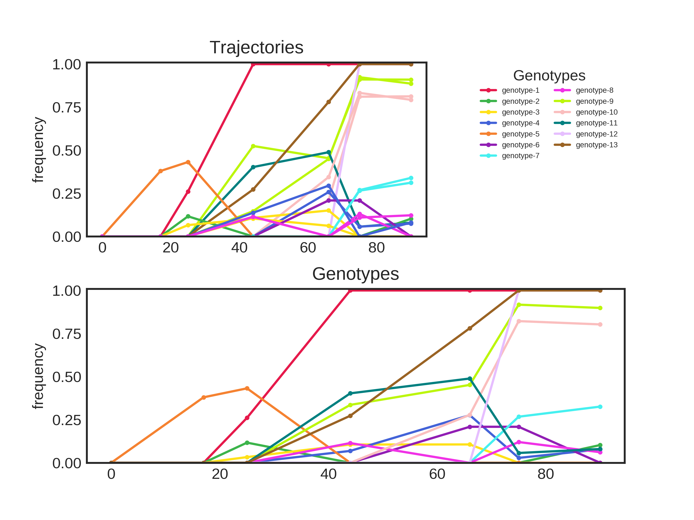

# Output
All files are prefixed by the name of the original input table.

## Tables
### Genotype and Trajectory tables
- .muller_genotypes.tsv
- .muller.trajectories.tsv
- tables/.muller_genotypes.original.tsv
- tables/.trajectories.original.tsv

Tables listing the genotypes and trajectories encountered in the analysis. The trajectory tables also link each trajectory to its respective genotype. There are two versions of these tables: one set with the original input trajectories and the initial calculated genotypes and another set with the final trajectories and genotypes left in the analysis after the filtering step. The trajectory tables include all columns from the input trajectory table as well as the timeseries and annotation columns used in the analysis.

Example Genotype Table:
| Genotype    | 0.000 | 17.000 | 25.000 | 44.000 | 66.000 | 75.000 | 90.000 |
| ----------- | ----- | ------ | ------ | ------ | ------ | ------ | ------ |
| genotype-1  | 0.000 | 0.380  | 0.432  | 0.000  | 0.000  | 0.000  | 0.000  |
| genotype-2  | 0.000 | 0.000  | 0.000  | 0.403  | 0.489  | 0.057  | 0.080  |
| genotype-3  | 0.000 | 0.000  | 0.000  | 0.000  | 0.000  | 1.000  | 1.000  |
| genotype-4  | 0.000 | 0.000  | 0.261  | 1.000  | 1.000  | 1.000  | 1.000  |
| genotype-5  | 0.000 | 0.000  | 0.000  | 0.273  | 0.781  | 1.000  | 1.000  |
| genotype-6  | 0.000 | 0.000  | 0.092  | 0.052  | 0.031  | 0.000  | 0.052  |
| genotype-7  | 0.000 | 0.000  | 0.000  | 0.000  | 0.278  | 0.822  | 0.803  |
| genotype-8  | 0.000 | 0.000  | 0.000  | 0.336  | 0.452  | 0.918  | 0.899  |
| genotype-9  | 0.000 | 0.000  | 0.000  | 0.076  | 0.043  | 0.219  | 0.255  |
| genotype-10 | 0.000 | 0.021  | 0.000  | 0.086  | 0.182  | 0.095  | 0.058  |

### Tables for ggmuller
- tables/.ggmuller.populations.tsv
- tables/.ggmuller.edges.tsv

These tables are designed for use with the ggmuller r package. The `populations` table describes the population/abundance of each genotype at each timepoint while the `edges` table describes the ancestry relationship between genotypes.

### Linkage matrix
- tables/.linkagematrix.tsv

This table is generated using the [scipy](https://docs.scipy.org/doc/scipy/reference/cluster.hierarchy.html) python package. It describes the agglomeration of clusters starting with the individual trajectories, as well as the mean, variance, and trajectory count of each cluster.
Columns:
- `left`, `right`: The two sub-clusters merged to create the current clusters
- `clusterId`: The id assigned to this cluster. Note that since the individual genotypes are not included in the table, the clusters are numbered in order starting with 1 + the total number of genotypes.
- `distance`: The distance between the two sub-clusters.
- `observations`: The number of mutational trajectories contained in this cluster.

Example linkage matrix:
| left | right | distance | observations | resultingCluster |
|------|-------|----------|--------------|------------------|
| 7    | 18    | 0.034    | 2            | 19               |
| 13   | 17    | 0.175    | 2            | 20               |
| 8    | 11    | 0.199    | 2            | 21               |
| 2    | 5     | 0.239    | 2            | 22               |
| 10   | 3     | 0.279    | 2            | 23               |
| 9    | 12    | 0.370    | 2            | 24               |
| 23   | 6     | 0.529    | 3            | 25               |
| 22   | 21    | 0.624    | 4            | 26               |
| 26   | 1     | 0.708    | 5            | 27               |
| 24   | 16    | 0.760    | 3            | 28               |
| 14   | 25    | 0.786    | 4            | 29               |
| 15   | 20    | 0.988    | 3            | 30               |
| 29   | 27    | 1.094    | 9            | 31               |
| 31   | 19    | 1.358    | 11           | 32               |
| 30   | 28    | 1.362    | 6            | 33               |
| 4    | 32    | 1.499    | 12           | 34               |
| 33   | 0     | 2.125    | 7            | 35               |
| 34   | 35    | 4.943    | 19           | 36               |

### Distance Matrix
- tables/.distance.tsv

A table of pairwise distance values between each trajectory.

### Muller table
- tables/.muller.tsv

The converted form of the `.ggmuller.populations.tsv` and `.ggmuller.edges.tsv` used to generate the muller plots. This file is created from the r script, described later.

## Graphics
Each of the output plots use the same palette for genotypes and trajectories. A genotype colored a shade of blue will share that color across all graphs and diagrams which depict that genotype. There are two palettes: one to indicate each clade in the geneology and one to easily distinguish between different genotypes. Each graphic is created with both palettes, and some are provided in multiple formats for convienience.

### Muller Plots
- .muller.annotated.png
- graphics/clade/.muller.annotated.svg
- graphics/clade/.muller.annotated.png
- graphics/clade/.muller.unannotated.png
- graphics/distinctive/.muller.annotated.distinctive.png
- graphics/distinctive/.muller.annotated.distinctive.svg

The main value of a muller plot is to quickly visualize abundance and geneology of genotypes over the course of an evolution experiment.

### Geneology Plots
- .geneology.png
- graphics/.geneology.distinctive.png

These are simple flowcharts indicating the relationship between genotypes and clades. The original genotype of each clade are shown to arise in "genotype-0", the root background. The ancestry of all other genotypes are then shown relative to these clades.

### Trajectory and genotype plots
- .genotypes.png
- .genotypes.filtered.png
- .trajectories.distinctive.png

Timeseries plots of the frequency of each trajectory and genotype at each timepoint. Trajectories are colored according to which genotype they were grouped into. The `.genotypes.filtered.png` file includes trajectories that were filtered out during the filtering step (clored black).

### Distance Heatmap
- graphics/.heatmap.distance.png

A pairwise comparison of the calculated distance between each mutational trajectory. Trajectories are grouped by the final genotype. The heatmap will be annotated with the distance values if there are fewer than thirty total trajectories in the analysis.

### Dendrogram
- graphics/.dendrogram.png
Shows the arrangment and distance between clusters and member trajectories.

## Scripts
- scripts/example.mermaid.md
- scripts/example.r

Two external scripts are used during the course of this analysis. The r script is based on the [ggmuller](https://cran.r-project.org/web/packages/ggmuller/vignettes/ggmuller.html) package implemented in r, and is used to convert the genotypes data into a format required to generate the muller plots. This script also generates a basic muller plot (/graphics/distinctive/.muller.png), although all other muller plots are created with the python implementation. The [mermaid](https://mermaidjs.github.io) script is used to generate the geneology plots.

## Supplementary files
- supplementary-files/example.json

A json-formatted file with all parameters used in the analysis.
